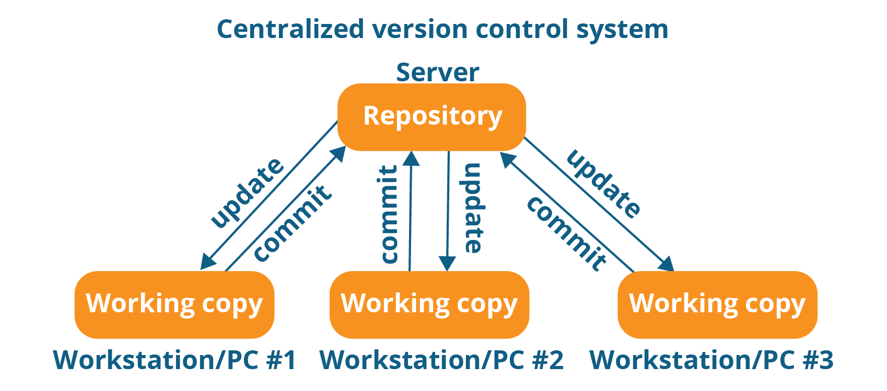
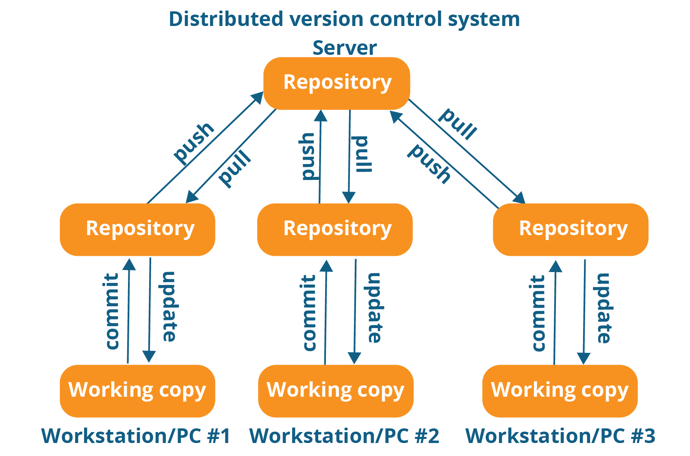

# Git Quick Tutorial

## Table of Content
- **Git Definition**
- **Version Control System (VCS)**
  - **Benefits of the VCS**
  - **Why Use a Version Control System** 
  - **Types of VCS**
  - **Popular Hosting Platform for VCS**
- **Basic Git command**
  

### Git
**Git** is a DevOps tool used for source code management. It is a free and open-source version control system used to handle small to very large projects efficiently.  

### Version Control System (VCS)
 **VCS** is basically software for tracking changes in any set of files, usually used for coordinating work among programmers collaboratively developing source code during software development. Its goals include speed, data integrity, and support for distributed, non-linear workflows (thousands of parallel branches running on different systems).

 ### Benefits of Version Control System
 - Through this VCS, project contributors or employees can work on it from anywhere, regardless of where they are physically located. For each contributor, a separate working copy is kept and isn't merged into the main file until the working copy has been validated. The most well-known examples are Microsoft TFS, Helix core, and Git.
 - It supports in recovery in the event of a catastrophe or emergency circumstance and provides information on Who, What, When, and Why modifications have been made.
 - It Decrease the incidence of errors and conflicts while the project is being developed by tracking every tiny changes.
 - it utilizes the staff's abilities, productivity, and speed of product delivery through improved communication and support.

### Why Use a Version CControl System

#### Collaboration
Software is created to address user issues. These solutions increasingly come in a number of shapes (such as mobile, embedded, SaaS) and operate in a range of settings, including cloud, on-prem, or edge.

#### Sharing 
**VCS** allows for communication, sharing, and coordination between every member of the software development team. Teams can work in distant and asynchronous environments thanks to version control software, which also helps them manage changes to code and other documents as well as merge conflicts and other oddities.

#### Copy of Work (sometimes called as checkout)**
It is the personal copy of all the files in a project. You can edit to this copy, without affecting the work of others and you can finally commit your changes to a repository when you are done making your changes.

#### Repository
It can be thought of as a database of changes. It contains all the edits and historical versions (snapshots) of the project.

 ### Types of Version Control System
 1. Local Version Control System
 2. Centralized Version Control System 
 3. Distributed Version Control System

#### Local Version Control System 
A **LVCS** is a local database located on your local computer, in which every file change is stored as a patch. Every patch set contains only the changes made to the file since its last version.

##### 
*Local Version Control Diagram*

#### Centralized Version Control System (CVCS)
**(CVCS)** are based on the idea that there is a single “central” copy of your project somewhere (probably on a server), and programmers will “commit” their changes to this central copy. “Committing” a change simply means recording the change in the central system. 

###### 
*Centralized Version Control Diagram*

#### Distributed Version Control System (DVCS)
**DVCS** brings a local copy of the complete repository to every team member's computer, so they can commit, branch, and merge locally. The server doesn't have to store a physical file for each branch — it just needs the differences between each commit.

##### 
 *Distributed Version Control Diagram*

### Popular Hosting Platform for VCS
1. Github [link :arrow_upper_right:](https://github.com/)
2. Gitbuket [link :arrow_upper_right:](https://github.com/gitbucket)
3. TuraVault [link :arrow_upper_right:](https://www.inflectra.com/)
4. Bitbucket [link :arrow_upper_right:](https://bitbucket.org/product)
5. SourceForge [link :arrow_upper_right:](https://sourceforge.net/)
6. AWS COdeCOmmit [link :arrow_upper_right:](https://aws.amazon.com/codecommit/)
7. Beanstalk [link :arrow_upper_right:](https://beanstalkapp.com/)
8. Phabricator [link :arrow_upper_right:](https://www.phacility.com/phabricator/)
9. Allura [link :arrow_upper_right:](https://allura.apache.org/)
10. Rhodecode [link :arrow_upper_right:](https://rhodecode.com/try-rhodecode)
11. Codegaint [link :arrow_upper_right:](https://codegiant.io/home)
    

    **[Basic Git Command](Basic_git_comand.md)**